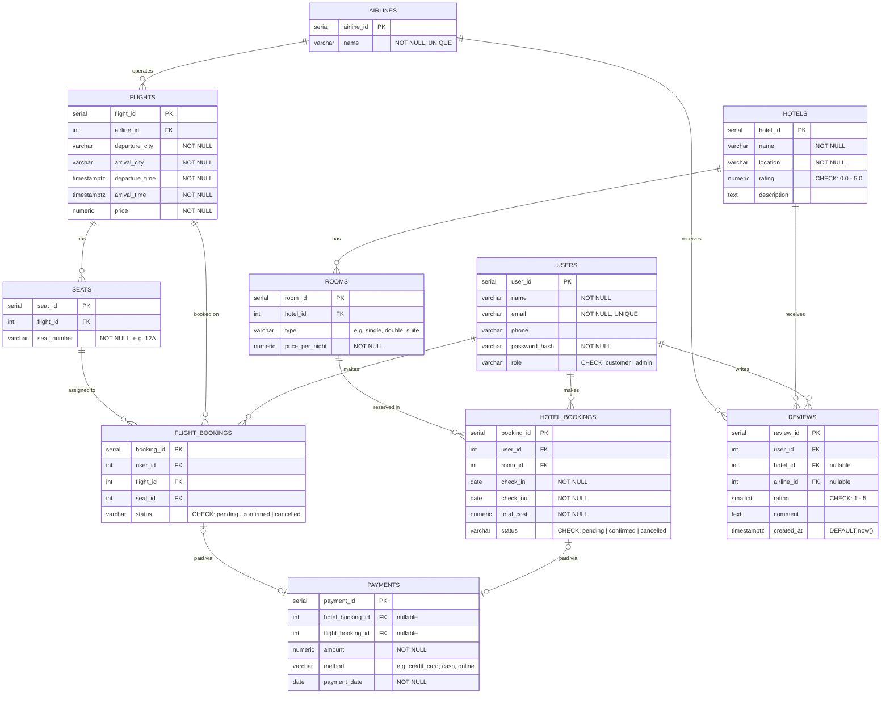

# Hotel Reservation & Flight Booking System (HRFBS)

HRFBS is a relational data model and reporting project built in PostgreSQL.

## Scope

HRFBS models an end-to-end travel workflow across hotels and flights:

- User and role management (`customer`, `admin`)
- Hotel inventory (hotels and rooms)
- Airline inventory (airlines, flights, seats)
- Booking lifecycle (pending, confirmed, cancelled)
- Payments and reviews across both booking domains

## Entity Relationship Diagram



## Repository Files

- `schema.sql`: Full schema definition, constraints, indexes, and trigger functions.
- `seed.sql`: Representative seed data for operational and reporting scenarios.
- `queries.sql`: Report-style analytics queries for revenue, occupancy, ranking, and behavior insights.
- `results.txt`: Reference output generated from running the query suite on seeded data.
- `erd.md`: Entity relationship diagram and design rationale.

## Quick Start

### Prerequisites

- PostgreSQL running locally or remotely
- `psql` CLI available in your shell

### Execution Order

```bash
# 1) Create database
createdb hrfbs

# 2) Build schema
psql -d hrfbs -f schema.sql

# 3) Load sample data
psql -d hrfbs -f seed.sql

# 4) Run analytics queries
psql -d hrfbs -f queries.sql
```

Optional: persist query output.

```bash
psql -d hrfbs -f queries.sql > results.txt
```

## HRFBS Design Principles

### Integrity First

- Room double-booking is blocked using overlap validation in a trigger.
- Flight seat conflicts are prevented with a partial unique index for active bookings.
- Payments enforce exactly one booking reference (hotel or flight, never both).
- Reviews enforce exactly one target entity (hotel or airline, never both).

### Operational Realism

- Booking states preserve lifecycle history instead of deleting records.
- `cancelled` records remain queryable for auditability.
- `total_cost` is stored on hotel bookings to preserve historical price truth.

### Analytics Readiness

- Query suite is written as business reports, not isolated SQL drills.
- CTEs and window functions are used where they improve clarity and insight.
- Outputs support decision-making for pricing, occupancy, customer value, and service quality.
- Performance is optimized with indexes on foreign keys, dates, and route columns.

## Notes

- `schema.sql` is rerunnable and begins with `DROP TABLE IF EXISTS ... CASCADE`.
- Always run `seed.sql` after `schema.sql`.
- Report outputs depend on the seeded dataset and booking statuses.
