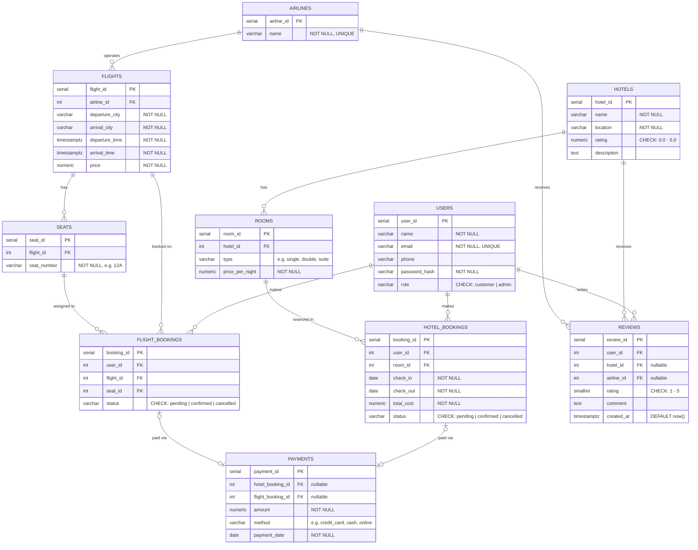

# Hotel Reservation & Flight Booking System — ERD

## Key Design Notes

| Constraint | Where | How |
|---|---|---|
| Double booking (rooms) | `hotel_bookings` | `BEFORE INSERT OR UPDATE` trigger checks for date overlaps on the same `room_id` |
| Double booking (seats) | `flight_bookings` | Partial `UNIQUE` index on `seat_id WHERE status != 'cancelled'` |
| Payment links to exactly one booking | `payments` | `CHECK ((hotel_booking_id IS NOT NULL AND flight_booking_id IS NULL) OR (hotel_booking_id IS NULL AND flight_booking_id IS NOT NULL))` |
| One review per user per hotel | `reviews` | Partial unique index: `UNIQUE(user_id, hotel_id) WHERE hotel_id IS NOT NULL` |
| One review per user per airline | `reviews` | Partial unique index: `UNIQUE(user_id, airline_id) WHERE airline_id IS NOT NULL` |
| Review links to exactly one entity | `reviews` | `CHECK ((hotel_id IS NOT NULL AND airline_id IS NULL) OR (hotel_id IS NULL AND airline_id IS NOT NULL))` |
| Room & flight availability | derived | Computed from booking overlaps / unbooked seat count — no stored boolean |